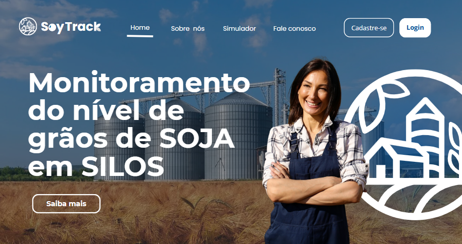
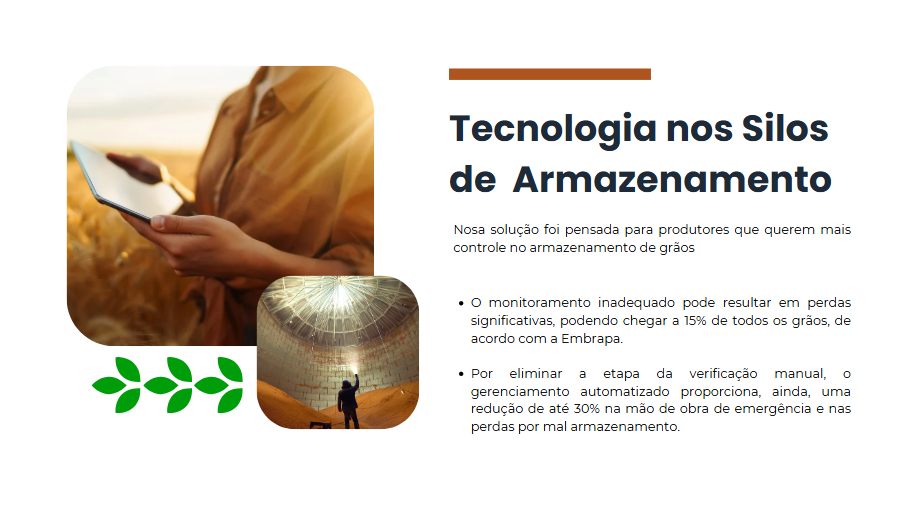
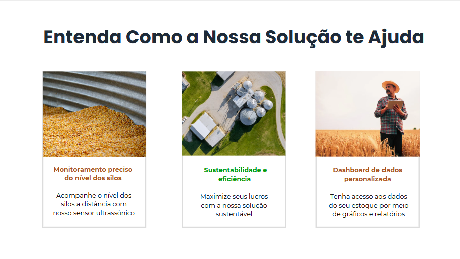
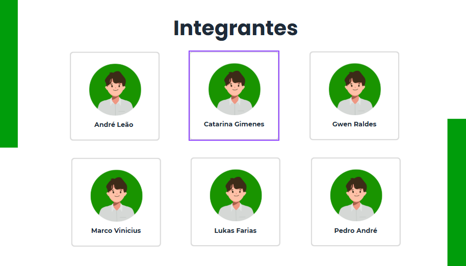
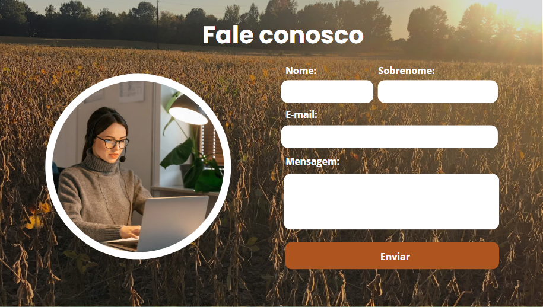
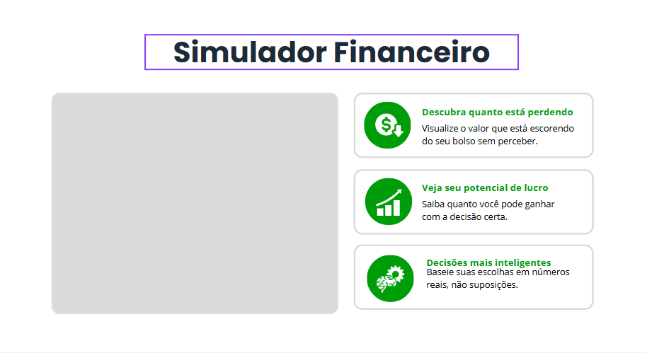
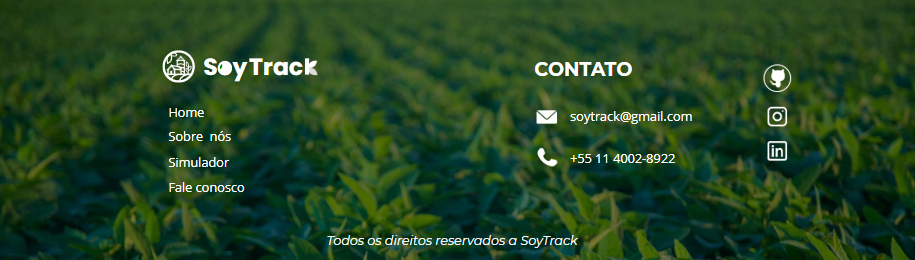

    

##  Monitoramento de grãos de soja em silos de armazenamento

Este projeto oferece uma solução IoT para monitoramento do nível de grãos em silos de soja, utilizando sensores ultrassônicos (HC-SR04) e uma dashboard personalizada para cada cliente. O objetivo é aumentar a eficiência no armazenamento, facilitar a tomada de decisões e reduzir desperdícios.

## ❗ Problema

Produtores rurais e cooperativas frequentemente enfrentam dificuldades para acompanhar o nível de grãos armazenados em silos. A falta de monitoramento contínuo pode resultar em desperdício, má gestão do estoque e até acidentes. 

## 💡 Solução

Nossa solução utiliza sensores ultrassônicos para medir a altura dos grãos nos silos em tempo real. Os dados são enviados para uma plataforma web, onde cada cliente pode:

- Visualizar seus silos em uma dashboard interativa
- Acompanhar o nível atual dos grãos
- Receber alertas e relatórios automáticos
- Tomar decisões mais precisas sobre armazenamento e escoamento

### Protótipo do site institucional

    

    

    

    

    

    

    

## 👨‍🌾 Público-alvo

- Produtores rurais
- Cooperativas agrícolas
- Gerentes de armazenagem
- Empresas de logística agrícola

## 🛠️ Tecnologias Utilizadas

 

**Hardware:**
- Sensor Ultrassônico HC-SR04
- Microcontrolador Arduino UNO R3

**Software:**
- Plataforma Web: HTML, CSS e JAVASCRIPT
- Backend: JAVASCRIPT, C++, Chart.js e Node.js
- Banco de Dados: MySQL Server

## 🤝 Equipe
<table>

<td  align="center"><a  href= "https://github.com/andreleao-sys"> <b> André </b></a> 
</td>

<td  align="center"><a  href= "https://github.com/CatarinaGimenes" > <b> Catarina </b></a> 
</td>

<td  align="center"><a  href="https://github.com/gwenraldes" > <b> Gwen </b></</a> 
</td>

<td  align="center"><a  href="https://github.com/LukasFah" > <b> Lukas </b></</a> 
</td>

<td  align="center"><a  href="https://github.com/Marco-ducca" > <b> Marco </b></</a> 
</td>

<td  align="center"><a  href="https://github.com/pedroa0627" > <b> Pedro André </b></</a> 
</td>

</table>

